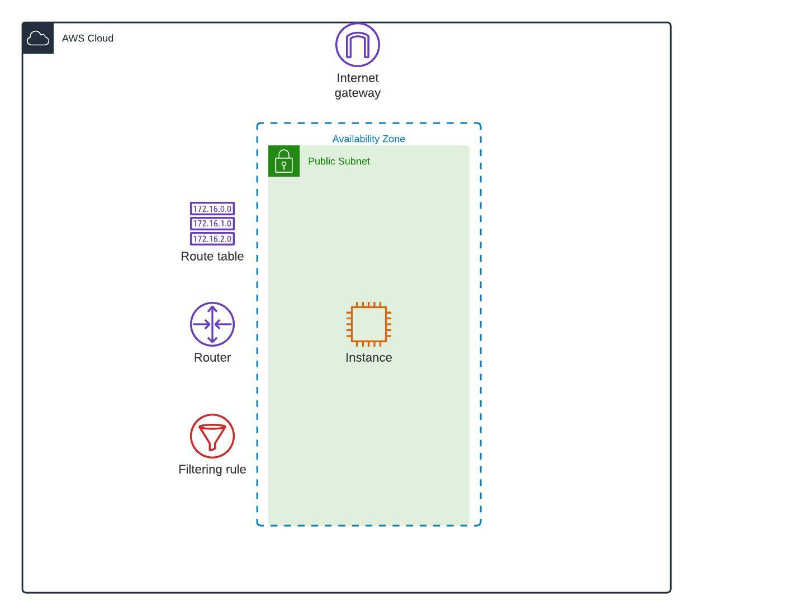

# AWS Single EC2 instance + Wordpress + CentOS + Terraform + Ansible

This project aims to deploy Wordpress on an EC2 instance using Terraform and Ansible Playbook.

**Built with**

Terraform manages AWS infrastructure deploymenet.
Ansible manages Wordpress deploy on an EC2 instance

**Requirements**

1. AWS account
2. IAM user with admin privileges
3. Access and secret keys
4. AWS CLI
5. Terraform installed
6. Ansible installed

**AWS resources created**

* 1 x VPC
* 1 x Private subnets
* 1 x Public subnets
* 1 x Internet Gateway
* 1 x EC2
* 1 x Security Groups

**Getting started**

Clone the repository locally in your system:

`git clone`

Deploy the code in your AWS account with Terraform

`cd directory`

`terraform init`

`terraform validate`

`terraform plan`

`terraform apply`

`terraform destroy`

**Folder structure options and naming conventions for software projects**
```
.
|-- main.tf                 # AWS provider's configuration
|-- networking.tf           # VPC, subnet, routing tables, etc.
|-- computing_ec2.tf        # EC2 instances setting
|-- security.tf             # Security groups
|-- ssh_keys.tf             # EC2 public key
|-- variables.tf            # Variables
|-- output.tf               # Output values
|-- ansible                 # Ansible playbook
|-- diagram01.jpeg          # AWS network layout
|-- LICENSE.txt
|-- README.md
```

**Architecture**



**Contributing**

Contributions are what make the open-source community such an amazing place to learn, inspire, and create. Any contributions you make are greatly appreciated.

If you have a suggestion to improve this, please fork the repo and create a pull request. You can also open an issue with the tag "enhancement".

Don't forget to give the project a star! Thanks again!

**License**

It is distributed under the MIT License. See LICENSE.txt for more information.

**Contact**

Name: Eugenio Duarte

Email: eduarte@cloudacia.com
